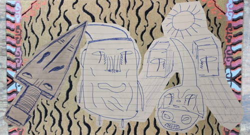

#+ATTR_ORG: :width 600

- ([[https://berserk.fandom.com/wiki/Beherit][Berserk]] 𒉭, [[https://ghibli.fandom.com/wiki/No-Face][Spirited Away]], and [[https://en.wikipedia.org/wiki/Moai][tribal]] influenced doodles placed on top of a Tibetan tiger skin textile)
 
--------------

Q: Will you ever become an [[https://en.wikipedia.org/wiki/Four_stages_of_awakening][arahant]]?

A: I worry that I've spent and wasted too much of my life on carnal/trivial matters, and in an undisciplined and unrestrained/heedless manner, to the point where I can no longer attain such things, given who I am and what I've become, my patterns and conditionings, and given the time that I have left. But worries are often just the source and generator for additional worries and nothing more, so we'll put that to the side for a bit, and see what I can make happen here. The mind loves to spend time solving the unsolvable, and proceeding without ever checking its axioms. The least I can do is try, and give these things a noble effort. What other choice do I have? Give up? That's not a choice anyone would sanely make given the situation I'm in. I might as well kill myself given that logic. That's what "giving up" equates to. If Frank Yang got things really going by his 30's, I'll see what I can do. I may need to tweak the way I'm living, behaving, and reacting, which is the part of the process that I'm not too fond of, to put things lightly. Who genuinely likes change, especially with no promises of a positive outcome, but with an assurance of a genuine hard toil and bloody trials ahead, which is how reality is constructed? Nothing is guaranteed. You could just become the next modern-day sisyphus. Not many like this fact, including me. I guess we probably have that in common. However even our apparent friendship is impermanent, and fleeting. And why be friends with our limitations? Why not be friends, and on speaking terms with the truth? And why worry yourself about becoming a sisyphus, when your death is inevitable? Does the effort itself towards disattuning to lies not carry any merit? If this does not carry any merit, then what action does? Why be so concerned about any of this in the first place, or be concerned about anything, or be concerned about life itself, or pain, or your very life at that? Everyone detests lies, but lives and thrives in illusion with total abashment. Everyone would like to be an arahant, but no one wants to train. I'll be the motherfucker that trains. You can call this a Rocky story if you'd like, and these writings, my statement of intent. I will no longer identify with my limitations, but instead will abide, inhabit, seek out, and express the truth. Tick tock, I'm coming forward, and won't stop till I drop. "Nothing likes to stand in the way of something that is relentless." - Goggins.
