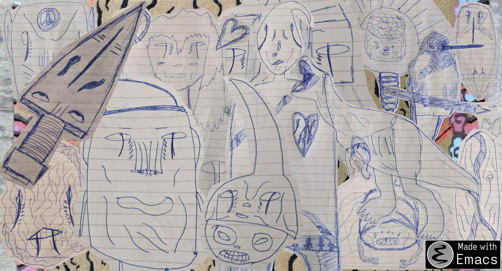

#+ATTR_ORG: :width 600

# #+HTML: 
   

# #+HTML: <table cellpadding="0"> <tr style="padding: 0"> <td valign="top"> </td> <td valign="bottom"> </td></tr> </table>

#+HTML: <table cellpadding="0"> <tr style="padding: 0"> <td valign="bottom"> <video src="https://github.com/greghab/greghab/assets/7407672/938dda93-d896-4b42-9820-e0af3b566b82" /></td> <td valign="bottom"><video src="https://github.com/greghab/greghab/assets/7407672/da534a25-687e-4018-aed8-02bdfc924bcc" /></td></tr> </table>

#+HTML: <table cellpadding="0"> <tr style="padding: 0"> <td valign="top"> <blockquote> “Heedfulness is the way to the deathless: heedlessness is death” </blockquotex> </td> <td valign="bottom"> <blockquote> "Everything worthwhile is uphill ... Climb all the way." </blockquote </td></tr> </table>

# marks:
|------------------------------+-----------+-----------+----------+-----------+---------------+-----------+---------------+-----------+------------+------------+-----------+-------------+---------------+-------------|
| [[file:README.org][Link]]=Proof-of-Work Available | 🎇Weik🎇 | 🫧Keit🫧 | 🫀Aki🫀 | 🐲Prey🐲 | 🌴Eskapade🌴 | 🐚لَحني🐚 | 🥀Dahin-mi🥀 | 🥋Kalt🥋 | 🔊Lunar🪐 | 🪂Gyana🪂 | 🌋Kies🌋 | 🪅Recall🪅 | ♟️P-Streak♟️ | 🌁Schlaf🌁 |
|------------------------------+-----------+-----------+----------+-----------+---------------+-----------+---------------+-----------+------------+------------+-----------+-------------+---------------+-------------|
| 🤺 09-10-23 🤺              |           |           |          |           |            🌴 |        🐚 | 2.9/52:00     |           |            |            |           | 🪅          |            11 |             |
|------------------------------+-----------+-----------+----------+-----------+---------------+-----------+---------------+-----------+------------+------------+-----------+-------------+---------------+-------------|
| 📿 09-11-23 📿              |     09:00 |           |          |           |          3:30 |      6:00 | 3.28/33:30    |           |            |            |           |             |       13/7:30 |             |
|------------------------------+-----------+-----------+----------+-----------+---------------+-----------+---------------+-----------+------------+------------+-----------+-------------+---------------+-------------|
| 🧪 09-12-23 🧪              |           |           |          |           |          5:00 |      5:00 | 3.2/35:00     |           |            |            |           |             |            15 |             |
|------------------------------+-----------+-----------+----------+-----------+---------------+-----------+---------------+-----------+------------+------------+-----------+-------------+---------------+-------------|
| 💌 09-13-23 💌              |           |           |          |           |               |           |               |           |            |            |           |             |               |             |
|------------------------------+-----------+-----------+----------+-----------+---------------+-----------+---------------+-----------+------------+------------+-----------+-------------+---------------+-------------|
| 🔮 09-14-23 🔮              |           |           |          |           |               |           |               |           |            |            |           |             |               |             |
|------------------------------+-----------+-----------+----------+-----------+---------------+-----------+---------------+-----------+------------+------------+-----------+-------------+---------------+-------------|
| 🛫 09-15-23 🛫              |           |           |          |           |               |           |               |           |            |            |           |             |               |             |
|------------------------------+-----------+-----------+----------+-----------+---------------+-----------+---------------+-----------+------------+------------+-----------+-------------+---------------+-------------|

#+HTML: <table cellpadding="0"> <tr style="padding: 0"> <td valign="top"> 
 Most Recent Doodle: 
</td> <td valign="bottom"> 
 Most Recent Melody: 
 <video src="https://github.com/greghab/greghab/assets/7407672/c6e360e6-ee87-477e-aaff-403f317ad0c2" /> </td></tr> </table>

#+begin_quote
- Thomas Edison's teachers told him he was 'too stupid to learn anything'
- Vincent Van Gogh sold only one painting, 'The Red Vineyard,' in his life, and the sale was just months before his death
   - If he had given up his artistic career after it proved to strain his financial and emotional well-being, the art world would be missing hundreds of paintings from a true master.
- After Harrison Ford's first small movie role, an executive took him into his office and told him he'd never succeed in the movie business
- Theodor Seuss Geisel, better known as Dr. Seuss, had his first book rejected by 27 different publishers
- Aerospace engineer Clayton Anderson was rejected by NASA 15 times before finally going to space
- Lucille Ball appeared in so many second-tier films at the start of her career that she became known as 'The Queen of B Movies'
- Winston Churchill was estranged from his political party over ideological disagreements during the 'wilderness years' of 1929 to 1939
- A young Henry Ford ruined his reputation with a couple of failed automobile businesses
- While developing his vacuum, Sir James Dyson went through 5,126 failed prototypes and his savings over 15 years
- Stephen King grew so frustrated over his attempt to write the novel 'Carrie' that he threw away the entire early draft
#+end_quote
