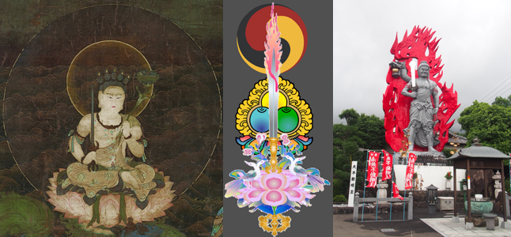

#+ATTR_ORG: :width 600
[[file:img/drawings-500x-background-tiger.png]]
- ([[https://berserk.fandom.com/wiki/Beherit][Berserk]] 𒉭, [[https://ghibli.fandom.com/wiki/No-Face][Spirited Away]], and [[https://en.wikipedia.org/wiki/Moai][tribal]] influenced doodles placed on top of a Tibetan tiger skin textile)
 
--------------

#+begin_quote
"[The wanderer Vacchagotta asked the Blessed One:] “Then does Master Gotama hold any speculative view at all?” “Vaccha, ‘speculative view’ is something that the Tathāgata has put away. For the Tathāgata, Vaccha, has seen this: ‘Such is form, such its origin, such its passing away...Therefore, I say, with the destruction, fading away, cessation, giving up, and relinquishing of all conceiving, all rumination, all I-making, mine-making, and the underlying tendency to conceit, the Tathāgata is liberated through not clinging.”"
#+end_quote

#+ATTR_ORG: :width 600

- Gankyil Triratna Moek
  - [[https://en.wikipedia.org/wiki/Manjushri][Manjushri]], the OG spiritual swordsman.
